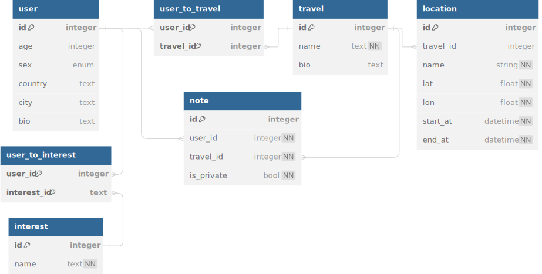

# Travel Agent Bot

[@travel_agent_samylovma_bot](https://t.me/travel_agent_samylovma_bot)

## Запуск

```sh
docker compose up
```

`compose.yaml` состоит из 3-х сервисов: самого приложения, резидентной
СУБД Redis и ОРСУБД PostgreSQL. Сборка образа приложения состоит из
нескольких этапов (multi-stage build): установка пакетного менеджера PDM
и установка зависимостей в изолированное окружение, копирование
зависимостей приложения в итоговый образ для получения наименьшего размера.


## Интерфейс

### Запуск

Запуск бота происходит по стандартной команде /start. Мы не просим
пользователя указывать информацию о себе при первом взаимодейсвии, так
как для базового использования бота этого не требуется. Но он может в
любой момент добавить/изменить её по команде /settings.


### Настройки

Как упоминалось выше, по команде /settings пользователь может изменить
данные своего профиля: возраст, пол, город и страна местонахождения, описание.


### Создание путешествия

Создание путешествия осуществляется по команде /newtravel. При создании
требуется только указать для неё название. После этого пользователю
будет предложено меню этого путешествия.


### Список путешествий

По команде /travels бот предложит список путешествий пользователя,
при нажатии на любой их них откроется меню выбранного путешествия.


### Меню путешествия

В тексте сообщения содержится полезная информация о путешествии:
название, описание и локации в порядке их посещения.

Кнопка «Маршрут» построит кратчайший автомобильный путь от точки нахождения
пользователя (если указано в настройках) по всем локациям путешествия по порядку.
Изображение маршрута максимально оптимизировано, чтобы у пользователя
оно загружалось как можно быстрее.

Кнопка «Пригласить» предложит пользователю отправить ссылку-приглашение
другим пользователям, кого он хочет добавить в путешествие.
Ссылка-приглашение содержит уникальный токен, который действует 24 часа.


### Заметки

Для добавления заметки достаточно всего лишь отправить фото или файл с
описанием (!) и выбрать путешествие, к которому заметка должна быть прикреплена.
После добавления будет возможность сделать её публичной, то
есть доступной всем пользователям в путешествии.


# Технологический стек

Язык программирования -- Python 3.12.
Как фреймворк для Телеграм-бота выбран `python-telegram-bot`, так как он имеет хорошую поддержку и большое сообщество.

В качестве ОРСУБД выбрана PostgreSQL из-за её высокой производительности и широким спектром типов данных.

ORM для неё выбрана `SQLAlchemy` с высокопроизводительным драйвером `asyncpg`.


## Внешние интеграции

Мы используем следующие внешние сервисы:

* Open Source Routing Machine (router.project-osrm.org).
* Nominatim (nominatim.openstreetmap.org).
* OpenStreetMap Carto (a.tile.openstreetmap.org).


# Схема базы данных


